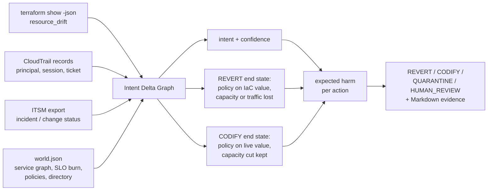

# TERRACOG

**When live infrastructure and Terraform disagree, which one is right?**

TERRACOG links each drifted attribute to who changed it and why, estimates the harm of reverting it,
codifying it, holding it or escalating it, and recommends the lowest-harm action with the evidence.

Drift detection is solved: `terraform plan` shows the difference. What it does not tell you is whether
to **revert** the cloud to the code, **codify** the live change into the code, **quarantine** it
(keep it, stop Terraform from touching it for now), or **page a human**. Revert an emergency fix
and you re-trigger the incident. Codify an attacker's change and it is now "infrastructure as code".

> v0.1 research prototype. Local only: reads plan JSON, CloudTrail records and a ticket export, never
> applies anything, no cloud account, no LLM. All benchmark data is **synthetic** and every label and
> harm value was **assigned by the author**.



## Worked example

Benchmark case `sg-ssh-world-during-incident` (synthetic): during an open incident, the on-call
break-glass role opens SSH on the checkout security group to the whole internet. Provenance says
"legitimate emergency, hold it"; security says "world-open SSH, revert it". Render the case into
real-format files and decide:

```text
$ python -m terracog render sg-ssh-world-during-incident --out build/case
wrote build/case/plan.json cloudtrail.json tickets.json world.json  (SYNTHETIC; label: HUMAN_REVIEW)

$ python -m terracog decide --plan build/case/plan.json --events build/case/cloudtrail.json \
    --tickets build/case/tickets.json --world build/case/world.json --report build/case/decision
HUMAN_REVIEW  aws_security_group.checkout_app.ingress  [emergency_active] INC-1044 is an open incident on checkout
wrote build\case\decision.json and build\case\decision.md

$ cat build/case/decision.md
...
## `aws_security_group.checkout_app.ingress` -> HUMAN_REVIEW

- Intent: **emergency_active** (confidence 0.9): INC-1044 is an open incident on checkout
- Last change: `AuthorizeSecurityGroupIngress` by `breakglass-oncall/bo@INC-1044` at 2026-09-01T11:30:00Z
- Ticket: INC-1044 (incident, open, checkout)
- Service: checkout (tier 1, burn rate 2.5), dependents: edge
- Policies violated by live: no-world-admin-ports, world-ingress-only-web; by IaC: none

| Action | Estimated harm |
|---|---|
| REVERT | 5.7 |
| CODIFY | 11.0 |
| QUARANTINE | 5.6 |
| HUMAN_REVIEW | 3.7 |

Graph edges: aws_security_group.checkout_app -part_of-> checkout; checkout -depended_on_by-> edge; ...
```

The provenance is verified (the session cites a ticket that exists, is open and is for the same
service), but codifying or holding a world-open admin port is expensive, so the recommendation is to
page a human now. The author-assigned harm for this case is REVERT 5, CODIFY 10, QUARANTINE 7,
HUMAN_REVIEW 2, so TERRACOG's regret is 0; severity-only triage reverts (regret 3) and the
provenance-rules ablation quarantines (regret 5). The committed copy of this report is
[`reports/example-decision.md`](reports/example-decision.md).

## Results

From [`reports/benchmark.md`](reports/benchmark.md): 56 synthetic drift cases, 4 of them negative.
CDR (Counterfactual Drift Regret) = harm of the chosen action minus the lowest harm available for the
case; lower is better. Wrong auto-remediation = chose REVERT or CODIFY and that was not the correct action.

| Method | Correct | Mean CDR | Wrong auto-remediation | Regret >= 5 |
|---|---|---|---|---|
| Always revert to Terraform | 18/56 | 2.75 | 38 | 11 |
| Always codify live state | 17/56 | 3.6786 | 39 | 18 |
| Always page a human | 9/56 | 1.625 | 0 | 5 |
| Severity-only triage (tfdrift-style) | 17/56 | 2.125 | 24 | 8 |
| Provenance rules, no counterfactual (ablation) | 41/56 | 0.8393 | 11 | 4 |
| Counterfactual, provenance ignored (ablation) | 16/56 | 1.375 | 21 | 4 |
| Counterfactual, no dependency blast radius (ablation) | 42/56 | 0.4464 | 11 | 1 |
| **TERRACOG** | 39/56 | **0.5893** | 11 | 2 |

- **Provenance is what matters.** Ignoring who changed it and why raises mean CDR from 0.5893 to 1.375.
  Every fixed policy and severity-only triage do worse still; severity-only reverts four of the six
  emergency hotfixes, the ones that touch a high/critical attribute (mean CDR 6.6667 on that category).
- **The counterfactual layer's gain over provenance rules alone is not established.** TERRACOG beats
  a runbook-style intent table by 0.25 mean CDR, but the paired bootstrap interval is [-0.1964, 0.7679].
  The counterfactual wins where provenance and security disagree (a debug port left world-open after a
  resolved incident, world-open SSH during an open one, an *approved* wildcard IAM grant); the rules win
  on benign unticketed changes, which TERRACOG reverts because codifying an unreviewed change is
  charged a penalty.
- **The dependency blast-radius term did not help.** Removing it gives a lower mean CDR (0.4464):
  three cases improve and none gets worse. One is ordinary (`task-count-cut-approved`); two are
  negative cases it gets right by luck (`NEG-spoofed-breakglass`, `NEG-cost-not-modelled`), because a
  smaller SLO stake makes reverting look cheaper. Kept in v0.1 as specified; this is a measured
  negative result for that component.

Evidence coverage: 54/56 drifts have a linked audit event; 31/56 have verified provenance. The full
per-case table, per-category means and the bootstrap intervals for every method are in the report.

## Quickstart

Python 3.10+, no dependencies beyond `pytest` for the tests.

```bash
python -m pip install "pytest>=8"
python -m pytest -q
python -m terracog render hotfix-checkout-min-size --out build/case    # one SYNTHETIC case as real-format files
python -m terracog decide --plan build/case/plan.json --events build/case/cloudtrail.json \
    --tickets build/case/tickets.json --world build/case/world.json --report build/case/decision
python -m terracog bench --out reports                                 # the benchmark, under a second
```

For your own drift: `terraform plan -out p.tfplan && terraform show -json p.tfplan > plan.json`, a
CloudTrail log file (`{"Records": [...]}`) covering the time since the last apply, a ticket export
(`{"tickets": [{"id", "kind": "incident|change", "status", "service"}]}`) and a `world.json` modelled
on [`fixtures/world.json`](fixtures/world.json). `decide` only reads files and prints.

## Mechanism

- **Parsing real formats.** Drift comes from `resource_drift` in the plan (prior state vs refreshed
  object), one decision per changed attribute; the IaC value is the configured value from
  `resource_changes[].change.after`. Principals come from CloudTrail `userIdentity`: role name for
  `AssumedRole`, the full ARN tail (`user/<name>`) for IAM users. The ticket is the `INC-`/`CHG-`
  id in the role session name, the common convention for break-glass roles.
- **Intent Delta Graph.** For each drift: resource -> service -> transitive dependents; the latest
  event that touched *that attribute* (event name -> attribute map) -> principal -> cited ticket ->
  its status and service; attribute -> policies violated by the IaC value and by the live value. The
  edges are printed in the evidence report.
- **Intent.** Controller role changing a field it owns (`controller`), open/resolved incident for the
  same service (`emergency_active` / `emergency_resolved`), approved change for the same service
  (`approved_change`), known engineer with no ticket (`ad_hoc`), missing / wrong-service / break-glass
  without ticket (`unverified`), principal outside the directory (`suspicious`), no event (`unknown`).
  Each has a fixed confidence.
- **Counterfactual harm.** REVERT = policy severity of the IaC value + capacity or traffic removed while
  the service is burning error budget + what reverting that intent loses. CODIFY = policy severity of
  the live value + capacity cut kept + what codifying that intent legitimises. QUARANTINE and
  HUMAN_REVIEW keep live state for days or hours (0.6 and 0.3 of the live exposure) plus a hold cost or
  one unit of toil. The SLO stake is tier weight x (1 + 0.5 x dependents). Harms are mixed with the
  `unknown` intent by confidence; ties go to the more reversible action.

## Threat and failure model

TERRACOG never applies anything; a person or a pipeline with its own approval step acts on the
recommendation. `world.json`, the plan and the ticket export's existence/service/status are trusted;
CloudTrail content is attacker-influenced, because whoever assumes a role chooses the session name and
so the cited ticket. Trust boundaries, threats and controls: [`docs/THREAT_MODEL.md`](docs/THREAT_MODEL.md).

**Failure taxonomy.** Drift classes in the benchmark (cases per category): security-group mutation 7,
emergency hotfix 6, controller-managed field 5, tag drift 5, public exposure 5, replica change 5,
DNS change 5, resolved incident 4, approved but uncodified 4, IAM widening 3, config drift 3,
negative 4. Provenance failures and how each ends:

| Failure class | Case(s) | Outcome |
|---|---|---|
| Principal outside the directory (incl. an IAM user named like a trusted role) | `tag-by-unknown-principal`, `sg-postgres-world-unknown`, unit test | `suspicious`; never held or codified |
| Ticket missing, for another service, or break-glass without one | `rds-public-unverified-ticket`, `ticket-for-other-service` | `unverified`; codify carries a penalty |
| No audit event for the attribute | `tag-backup-no-event` | `unknown`; reverted, labelled HUMAN_REVIEW (CDR 2) |
| Stolen break-glass session citing a real open incident | `NEG-spoofed-breakglass` | fails: human review, not revert (CDR 5) |
| CloudTrail delivery lag hides the hotfix's event | `NEG-audit-log-gap` | fails: escalated instead of held (CDR 1) |
| Incident mitigated long ago, never closed | `NEG-stale-incident` | fails: the hold never expires (CDR 2) |
| Harm dimension not modelled (cost) | `NEG-cost-not-modelled` | fails: extra capacity looks free (CDR 2) |
| Harm of keeping a suspicious non-policy change live while waiting | `dns-hijack-unknown` | fails outside the negative set: human review, not revert (CDR 6) |

The four negative cases were written in advance and are pinned by `test_known_blind_spots_stay_documented`.
**Not covered by any case:** interacting drifts across attributes, out-of-band deletes and creations
(rejected by the parser), tampered or incomplete CloudTrail beyond delivery lag, errors in
`world.json` itself (a wrong directory entry or missing dependency edge), compliance deadlines, data
loss from destructive reverts, and Azure.

## Experiment design

- **Cases.** 56 cases in [`fixtures/cases.json`](fixtures/cases.json) over 21 resources in one invented
  AWS environment ([`fixtures/world.json`](fixtures/world.json)), one drifted attribute each, rendered
  into Terraform plan JSON (format 1.2), CloudTrail records and a ticket export and then parsed back
  through the same parsers `decide` uses. Correct actions: REVERT 18, CODIFY 17, QUARANTINE 12,
  HUMAN_REVIEW 9.
- **Labels and harm.** For every case the author assigned the harm of all four actions on a 0-10
  rubric (in `cases.json`); the label is the unique lowest-harm action, checked on load.
- **Naive baselines.** Always revert, always codify, always page a human.
- **Prior-art-inspired baseline.** Severity-only triage, modelled on tfdrift: severity by resource type
  and attribute only; critical/high -> REVERT, medium -> HUMAN_REVIEW, low (tags) -> CODIFY. The tier
  to action mapping is this repository's.
- **Ablations.** Provenance rules without the counterfactual (a runbook-style intent -> action table);
  the counterfactual with provenance ignored; the counterfactual without the dependency blast-radius term.
- **Metrics.** Correct actions, mean and total CDR, wrong auto-remediations, cases with regret >= 5,
  human reviews; also split into non-negative and negative cases and by category.
- **Interval.** Paired bootstrap of mean CDR(method) - mean CDR(TERRACOG), 2000 resamples of the
  cases, 95% interval, seed 7. The decisions themselves are deterministic.
- **Regenerate.** `python -m terracog bench --out reports` (benchmark JSON + Markdown) and the `render`
  / `decide` commands in the worked example (example decision). Reports record the commit, command,
  Python version, platform and an input hash.

## What this result does not establish

- **Not ground truth.** The author wrote the harm model, the rubric, the labels and the harm values;
  there is one labeller and no inter-rater agreement. The cases are a consistency check of one
  person's judgement.
- **Not a tuned or calibrated model.** The weights (`INTENTS`, `TIER_WEIGHT`, the 0.6/0.3 exposure
  factors in `engine.py`) are hand-set, were fixed before the first benchmark run and have not been
  tuned since; the numbers above are that first run.
- **Not that the counterfactual layer beats provenance rules.** The 0.25 mean CDR gap has a 95%
  interval of [-0.1964, 0.7679].
- **Not that the blast-radius term helps.** Removing it lowers mean CDR (0.4464 vs 0.5893).
- **Not performance on real drift.** All events, tickets and resources are synthetic; the bootstrap
  resamples these author-written cases and says how stable the ranking is on this set only.
- **Not a live-cloud result.** No fixture came from a real cloud account; nothing was applied.
- **Not a defence against stolen identity.** A stolen break-glass session with a real incident id
  looks legitimate (`NEG-spoofed-breakglass`).
- **Not a comparison with an LLM.** The README-blueprint baseline "LLM recommendation without
  counterfactual simulation" is not implemented (the portfolio rule is no LLM calls); the
  provenance-rules ablation is the closest deterministic stand-in and is not the same thing.

## Limitations

- Harm dimensions are security, capacity/traffic and intent. Cost, compliance deadlines and data loss
  from destructive reverts are not modelled, nor is the harm of keeping a suspicious non-policy change
  live while a human looks.
- One decision per attribute: interacting drifts (a security group plus a route table that only
  together expose a database) are evaluated separately.
- Only in-place updates; out-of-band deletes and creations are rejected. AWS only; Azure Activity Log
  input is not implemented. The fixtures carry only the attributes relevant to each drift.
- The plan's top level and `resource_changes` entries were checked against a plan emitted by Terraform
  1.16.2; `resource_drift` uses the same change shape.
- Holds have no enforced expiry; whatever applies a QUARANTINE must add one.

## Research lineage

- **NSync** ([arXiv 2510.20211](https://arxiv.org/abs/2510.20211)) infers intent from cloud API traces and
  synthesises IaC updates: it always codifies, and does that well (0.97 pass@3 on 372 drift scenarios).
  Reconciling IaC from API traces is not new and TERRACOG does not generate code at all.
- **tfdrift** ([arXiv 2608.18173](https://arxiv.org/abs/2608.18173), [OSS](https://github.com/sudarshan8417/tfdrift))
  classifies drift into four severity tiers by resource type and attribute and can auto-apply. The
  severity-only baseline here is modelled on that; the mapping from tier to action is this repository's.
- **TerraFormer** ([arXiv 2601.08734](https://arxiv.org/abs/2601.08734)) is verifier-guided IaC
  generation; it does not address drift. Cited for lineage only.
- **Commercial and OSS tools.** HCP Terraform health assessments and Spacelift detect drift and can
  reconcile (revert) automatically or on approval; Firefly codifies live state; env0's Drift Cause
  Analysis uses AWS/Azure audit events to explain who changed what, but leaves the decision to the
  user; driftctl is in maintenance mode. Practitioner guides already frame the choice as
  revert / align / ignore, decided by a human after reading CloudTrail.

So attribution from audit logs, severity classification, automatic revert and automatic codify all
exist. What this repository adds is narrower: the source-of-truth decision itself made explicit and
deterministic, scored against a harm model over both counterfactual end states, with a
reproducible regret metric and a benchmark that includes the cases where provenance lies. I found no
tool or paper that does this, which is a statement about my search, not a proof of novelty.

## Roadmap

v0.2: a reviewable PR (`ignore_changes` for holds, attribute patch for codify) instead of a report,
Azure Activity Log input, drift holds with enforced expiry, a harm term for keeping suspicious changes
live, cost as a harm dimension, and a second labeller.

## Layout

```
fixtures/world.json        SYNTHETIC environment: services, dependencies, policies, principals, event map
fixtures/cases.json        56 labelled cases with per-action harm and the rubric
terracog/engine.py         parsers, Intent Delta Graph, intent inference, counterfactual harm, evidence report
terracog/scenarios.py      renders a case into plan JSON, CloudTrail records and a ticket export
terracog/bench.py          baselines, ablations, CDR, bootstrap, benchmark report
reports/                   generated evidence (JSON + Markdown)
docs/THREAT_MODEL.md       what the tool trusts and what it does not control
```

MIT licensed.
