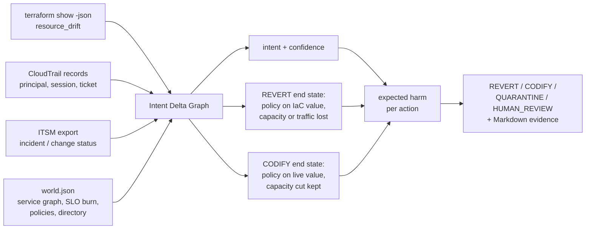

# TERRACOG

**When live infrastructure and Terraform disagree, which one is right?**

Drift detection is solved: `terraform plan` shows the difference. What it does not tell you is whether
to **revert** the cloud to the code, **codify** the live change into the code, **quarantine** it
(keep it, stop Terraform from touching it for now), or **page a human**. Revert an emergency fix
and you re-trigger the incident. Codify an attacker's change and it is now "infrastructure as code".
TERRACOG links each drifted attribute to who changed it, which ticket they cited, what depends on the
service, whether the service is burning error budget and which policies the old and new values
violate. It then estimates the harm of both counterfactual end states (reverted, codified) and of
holding or escalating, and recommends the lowest-harm action with the evidence.

> v0.1 research prototype. Local only: reads plan JSON, CloudTrail records and a ticket export, never
> applies anything, no cloud account, no LLM. All benchmark data is **synthetic** and every label and
> harm value was **assigned by the author**.



## Evidence

**Benchmark** ([`reports/benchmark.md`](reports/benchmark.md)): 56 synthetic drift cases over 21 AWS
resources: emergency hotfixes, resolved incidents, autoscaler- and AWS-managed fields, tag drift,
security-group mutation, public exposure, replica changes, DNS changes, approved-but-uncodified
changes, IAM widening, config drift, plus 4 negative cases written in advance. Each case defines the
harm of all four actions (0-10 rubric), so **Counterfactual Drift Regret** (CDR = harm of the chosen
action minus the lowest available harm) is reproducible. Correct actions: REVERT 18, CODIFY 17,
QUARANTINE 12, HUMAN_REVIEW 9.

| Method | Correct | Mean CDR | Wrong auto-remediation | Regret >= 5 |
|---|---|---|---|---|
| Always revert to Terraform | 18/56 | 2.75 | 38 | 11 |
| Always codify live state | 17/56 | 3.6786 | 39 | 18 |
| Always page a human | 9/56 | 1.625 | 0 | 5 |
| Severity-only triage (tfdrift-style) | 17/56 | 2.125 | 24 | 8 |
| Provenance rules, no counterfactual (ablation) | 41/56 | 0.8393 | 11 | 4 |
| Counterfactual, provenance ignored (ablation) | 16/56 | 1.375 | 21 | 4 |
| Counterfactual, no dependency blast radius (ablation) | 42/56 | 0.4464 | 11 | 1 |
| **TERRACOG** | 39/56 | **0.5893** | 11 | 2 |

What this does and does not show:

- **Provenance is what matters.** Ignoring who changed it and why raises mean CDR from 0.5893 to 1.375.
  Every fixed policy and severity-only triage do worse still; severity-only reverts four of the six
  emergency hotfixes, the ones that touch a high/critical attribute (mean CDR 6.6667 on that category).
- **The counterfactual layer's gain over provenance rules alone is not established.** TERRACOG beats
  a runbook-style intent table by 0.25 mean CDR, but the paired bootstrap interval is [-0.1964, 0.7679].
  The counterfactual wins where provenance and security disagree (a debug port left world-open after a
  resolved incident, world-open SSH during an open one, an *approved* wildcard IAM grant); the rules win
  on benign unticketed changes, which TERRACOG reverts because codifying an unreviewed change is
  charged a penalty.
- **The dependency blast-radius term did not help.** Removing it gives a lower mean CDR (0.4464):
  three cases improve and none gets worse. One is ordinary (`task-count-cut-approved`); two are
  negative cases it gets right by luck (`NEG-spoofed-breakglass`, `NEG-cost-not-modelled`), because a
  smaller SLO stake makes reverting look cheaper. Kept in v0.1 as specified; this is a measured
  negative result for that component.
- **This is partly true by construction.** The author wrote the harm model, the rubric and the labels.
  The model's weights (`INTENTS`, `TIER_WEIGHT`, the 0.6/0.3 exposure factors in `engine.py`) were set
  before the first benchmark run and have not been tuned since; the numbers above are that first run.
  That makes the cases a consistency check of one person's judgement, not ground truth.

**Negative cases (all four fail, as expected; pinned by tests):**

| Case | What happens | CDR |
|---|---|---|
| `NEG-spoofed-breakglass`: stolen break-glass session cites a real open incident and opens Postgres to the internet | indistinguishable from a real emergency; TERRACOG pages a human instead of reverting | 5 |
| `NEG-audit-log-gap`: CloudTrail has not delivered the hotfix's event yet | no link to the open incident; escalated instead of held | 1 |
| `NEG-stale-incident`: incident mitigated 30 days ago, never closed | the hold never expires | 2 |
| `NEG-cost-not-modelled`: unneeded upsize doubles cost | cost is not a harm dimension; extra capacity looks free | 2 |

Other TERRACOG errors include one severe one outside the negative set: `dns-hijack-unknown` (an
unknown principal repoints the public API record) goes to human review instead of revert (CDR 6),
because the harm of *keeping* a suspicious non-policy change live while waiting is not modelled.
The full per-case table is in the report.

## Quickstart

Python 3.10+, no dependencies beyond `pytest` for the tests.

```bash
python -m pip install "pytest>=8"
python -m pytest -q
python -m terracog render hotfix-checkout-min-size --out build/case    # one SYNTHETIC case as real-format files
python -m terracog decide --plan build/case/plan.json --events build/case/cloudtrail.json \
    --tickets build/case/tickets.json --world build/case/world.json --report build/case/decision
python -m terracog bench --out reports                                 # the benchmark, under a second
```

For your own drift: `terraform plan -out p.tfplan && terraform show -json p.tfplan > plan.json`, a
CloudTrail log file (`{"Records": [...]}`) covering the time since the last apply, a ticket export
(`{"tickets": [{"id", "kind": "incident|change", "status", "service"}]}`) and a `world.json` modelled
on [`fixtures/world.json`](fixtures/world.json). `decide` only reads files and prints.

## How it works

- **Parsing real formats.** Drift comes from `resource_drift` in the plan (prior state vs refreshed
  object), one decision per changed attribute; the IaC value is the configured value from
  `resource_changes[].change.after`. Principals come from CloudTrail `userIdentity`: role name for
  `AssumedRole`, the full ARN tail (`user/<name>`) for IAM users. The ticket is the `INC-`/`CHG-`
  id in the role session name, the common convention for break-glass roles.
- **Intent Delta Graph.** For each drift: resource -> service -> transitive dependents; the latest
  event that touched *that attribute* (event name -> attribute map) -> principal -> cited ticket ->
  its status and service; attribute -> policies violated by the IaC value and by the live value. The
  edges are printed in the evidence report.
- **Intent.** Controller role changing a field it owns (`controller`), open/resolved incident for the
  same service (`emergency_active` / `emergency_resolved`), approved change for the same service
  (`approved_change`), known engineer with no ticket (`ad_hoc`), missing / wrong-service / break-glass
  without ticket (`unverified`), principal outside the directory (`suspicious`), no event (`unknown`).
  Each has a fixed confidence.
- **Counterfactual harm.** REVERT = policy severity of the IaC value + capacity or traffic removed while
  the service is burning error budget + what reverting that intent loses. CODIFY = policy severity of
  the live value + capacity cut kept + what codifying that intent legitimises. QUARANTINE and
  HUMAN_REVIEW keep live state for days or hours (0.6 and 0.3 of the live exposure) plus a hold cost or
  one unit of toil. The SLO stake is tier weight x (1 + 0.5 x dependents). Harms are mixed with the
  `unknown` intent by confidence; ties go to the more reversible action.

## Prior art and what is not new

- **NSync** ([arXiv 2510.20211](https://arxiv.org/abs/2510.20211)) infers intent from cloud API traces and
  synthesises IaC updates: it always codifies, and does that well (0.97 pass@3 on 372 drift scenarios).
  Reconciling IaC from API traces is not new and TERRACOG does not generate code at all.
- **tfdrift** ([arXiv 2608.18173](https://arxiv.org/abs/2608.18173), [OSS](https://github.com/sudarshan8417/tfdrift))
  classifies drift into four severity tiers by resource type and attribute and can auto-apply. The
  severity-only baseline here is modelled on that; the mapping from tier to action is this repository's.
- **TerraFormer** ([arXiv 2601.08734](https://arxiv.org/abs/2601.08734)) is verifier-guided IaC
  generation; it does not address drift. Cited for lineage only.
- **Commercial and OSS tools.** HCP Terraform health assessments and Spacelift detect drift and can
  reconcile (revert) automatically or on approval; Firefly codifies live state; env0's Drift Cause
  Analysis uses AWS/Azure audit events to explain who changed what, but leaves the decision to the
  user; driftctl is in maintenance mode. Practitioner guides already frame the choice as
  revert / align / ignore, decided by a human after reading CloudTrail.

So attribution from audit logs, severity classification, automatic revert and automatic codify all
exist. What this repository adds is narrower: the source-of-truth decision itself made explicit and
deterministic, scored against a harm model over both counterfactual end states, with a
reproducible regret metric and a benchmark that includes the cases where provenance lies. I found no
tool or paper that does this, which is a statement about my search, not a proof of novelty.

**Not implemented:** the README-blueprint baseline "LLM recommendation without counterfactual
simulation". The portfolio rule is no LLM calls; the provenance-rules ablation is the closest
deterministic stand-in and is not the same thing.

## Limitations

- **Synthetic, author-labelled, one author.** 56 cases, one drifted attribute each, over one invented
  AWS environment. No real incident data; no inter-rater agreement.
- **Provenance is only as good as identity.** A stolen break-glass session with a real incident id
  looks legitimate (`NEG-spoofed-breakglass`).
- Harm dimensions are security, capacity/traffic and intent. Cost, compliance deadlines and data loss
  from destructive reverts are not modelled. The weights are hand-set, not learned or calibrated.
- One decision per attribute: interacting drifts (a security group plus a route table that only
  together expose a database) are evaluated separately.
- Only in-place updates; out-of-band deletes and creations are rejected. AWS only; Azure Activity Log
  input is not implemented. The fixtures carry only the attributes relevant to each drift.
- The plan's top level and `resource_changes` entries were checked against a plan emitted by Terraform
  1.16.2; `resource_drift` uses the same change shape. No fixture came from a real cloud account.

## Layout

```
fixtures/world.json        SYNTHETIC environment: services, dependencies, policies, principals, event map
fixtures/cases.json        56 labelled cases with per-action harm and the rubric
terracog/engine.py         parsers, Intent Delta Graph, intent inference, counterfactual harm, evidence report
terracog/scenarios.py      renders a case into plan JSON, CloudTrail records and a ticket export
terracog/bench.py          baselines, ablations, CDR, bootstrap, benchmark report
reports/                   generated evidence (JSON + Markdown)
docs/THREAT_MODEL.md       what the tool trusts and what it does not control
```

## Next (v0.2)

A reviewable PR (`ignore_changes` for holds, attribute patch for codify) instead of a report, Azure
Activity Log input, drift holds with enforced expiry, a harm term for keeping suspicious changes live,
cost as a harm dimension, and a second labeller.

MIT licensed.
